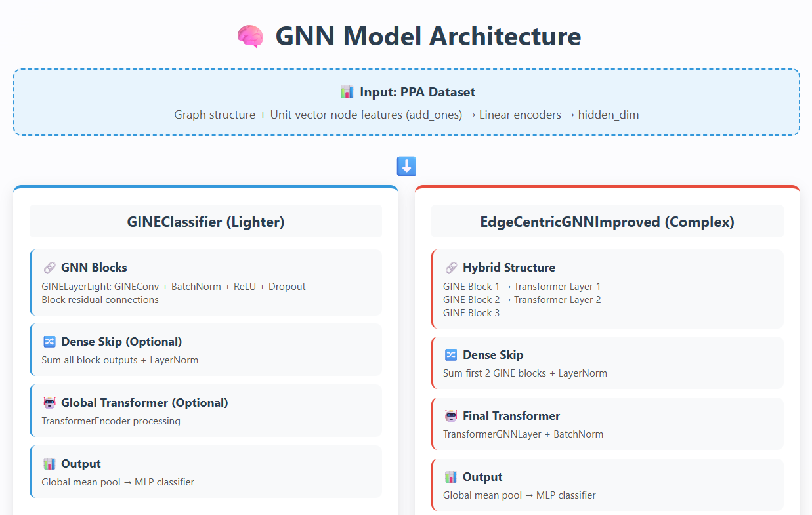

# Graph Classification with Noisy Labels - Solution

This project implements advanced Graph Neural Network (GNN) architectures for graph classification on subsets of the Protein-Protein Association (PPA) dataset, specifically addressing challenges posed by noisy labels. The primary models are `GINEClassifier` and `EdgeCentricGNNImproved`.

## Overview of the Method

The solution leverages two main Graph Neural Network architectures: `GINEClassifier` and `EdgeCentricGNNImproved`. Node features, which are absent in the original PPA dataset, are initialized as a unit vector (all ones) for each node using an `add_ones` transform. These initial features are then processed by learnable node encoders within each GNN model. Both models are designed to handle edge features and are trained with a strategy to mitigate the impact of noise.

Kaggle notebook: https://www.kaggle.com/code/franzin1886634/graph-neural-network-with-noisy-data-hackaton

**Key Components:**

1.  **GNN Architectures**:
    The project offers two primary GNN models, selectable based on configuration (e.g., `use_lightModel` in the notebook):
    *   **`GINEClassifier` Model** (often used as a "lighter" option):
        *   **Node and Edge Encoders**: Initial linear layers project the unit node features and raw edge features into a common `hidden_dim`.
        *   **GNN Blocks**: Composed of a configurable number of `num_gnn_blocks`, where each block contains `num_gine_layers_per_block` of `GINELayerLight`.
            *   `GINELayerLight`: Implements GINEConv (Graph Isomorphism Network with Edge features) with a custom MLP, PyTorch Geometric's `BatchNorm`, ReLU activation, and Dropout.
            *   **Block-level Residual Connections**: The output of each GNN block is added to its input, enhancing gradient flow and feature learning.
        *   **Dense Skip Connections (Optional)**: If `use_dense_skip=True`, the initial encoded node features and the output of each GNN block are summed. This aggregated representation is then normalized using PyTorch Geometric's `LayerNorm`. Otherwise, only the output of the final GNN block is passed forward.
        *   **Global Transformer (Optional)**: If `use_global_transformer=True`, the node embeddings (after GNN blocks and optional dense skip connections) are further processed by a standard `nn.TransformerEncoder`. This involves converting node embeddings to a dense batch format and applying `LayerNorm` to the transformer input.
        *   **Readout**: `global_mean_pool` is applied to the final node embeddings to obtain a graph-level representation.
        *   **Classifier**: A multi-layer perceptron (MLP) with ReLU activations and Dropout predicts the graph class.

    *   **`EdgeCentricGNNImproved` Model**:
        *   **Node and Edge Encoders**: Similar to `GINEClassifier`, these project initial unit node features and raw edge features to `hidden_dim`.
        *   **Hybrid GNN Structure**: This model features a more complex architecture with three main GINE blocks, interleaved with graph Transformer layers:
            *   **GINE Blocks**: Each block contains `num_gine_layers_per_block` of `GINELayer` modules.
                *   `GINELayer`: Implements GINEConv with a custom MLP, `nn.LayerNorm`, LeakyReLU (or ReLU) activation, and Dropout.
                *   Block-level residual connections are applied within each GINE block.
                *   PyTorch Geometric's `BatchNorm` is applied after the residual sum of each GINE block.
            *   **Graph Transformer Interlayers (`TransformerGNNLayer`)**: These layers, utilizing PyTorch Geometric's `TransformerConv`, are placed after the first and second GINE blocks, and also as a final processing layer. They include `nn.LayerNorm`, LeakyReLU (or ReLU), and Dropout.
        *   **Dense Skip Connections**: Outputs from the first two GINE blocks (after their respective `BatchNorm`) are added to the feature set before the final `TransformerGNNLayer`. This sum is then normalized using `nn.LayerNorm`.
        *   **Final BatchNorm**: PyTorch Geometric's `BatchNorm` is applied after the final `TransformerGNNLayer`.
        *   **Readout**: `global_mean_pool` aggregates node features into a graph embedding.
        *   **Classifier**: An MLP with ReLU activations and Dropout produces the final classification.

2.  **Noisy Label Handling**:
    *   **Noisy Cross-Entropy Loss (`NoisyCrossEntropyLoss`)**: Implements a re-weighting scheme `(1-p) * CE_loss`, where `p` is the estimated noise probability (e.g., `p_noisy` in the notebook, set based on the dataset ID like A, B, C, or D). This is the primary method used for handling noisy labels in the provided notebook.

3.  **Training**:
    *   **Optimizer**: Adam optimizer with weight decay.
    *   **Scheduler**: `ReduceLROnPlateau` scheduler, which reduces the learning rate when the validation F1 score stops improving.
    *   **Data Split**: Training data is split into training and validation sets (e.g., 80/20 split in the notebook).
    *   **Model Saving**: The model achieving the best F1 score on the validation set is saved.
    *   **Initialization**: Model weights are initialized using Xavier uniform initialization for linear layers.

4.  **Reproducibility**:
    *   Random seeds are set for PyTorch, NumPy, and Python's `random` module using a `set_seed()` utility function to ensure consistent results across runs.

## Image Teaser

## File Structure

-   `main.py`: Main script for training and prediction.
-   `requirements.txt`: Python dependencies.
-   `README.md`: This file.
-   `zipthefolder.py`: Provided script to package submissions.
-   `checkpoints/`: Stores trained model checkpoints (e.g., `model_A_epoch_10.pth`).
-   `source/`: Contains all implemented Python modules:
    -   `loadData.py`: `GraphDataset` class for loading data.
    -   `models.py`: `GNN` model definition.
    -   `utils.py`: Utility functions like `set_seed`.
    -   `noisy_loss.py`: `NoisyCrossEntropyLoss` class.
-   `submission/`: Output CSV prediction files (e.g., `testset_A.csv`).
-   `logs/<A,B,C,or_D>/`: Training logs and plots:
    -   `training_log_<foldername>.log`: Detailed log file.
    -   `plots/train_progress_<foldername>.png`: Training loss/accuracy plots.
    -   `plots/validation_progress_<foldername>.png`: Validation loss/accuracy plots.

## How to Run

1.  **Setup Environment**:
    All the requirements are installed in the first cells of the kaggle notebook (also uploaded in this repo as main.ipynb)

2.  **Download Datasets**:
    Datasets will be downloaded from drive when executing the cell: '!gdown --folderhttps://drive.google.com/drive/folders/1Z-1JkPJ6q4C6jX4brvq1VRbJH5RPUCAk -O datasets'

3.  **Train a Model (e.g., for dataset A)**:
    While running the kaggle notebook, write in the args the path for the training dataset you want to train on.

4.  **Generate Predictions using a Pre-trained Model (e.g., for dataset A)**:
    If no training path is given, the script will automatically select the best model based on the chosen test set (e.g. A, B, C or D).
